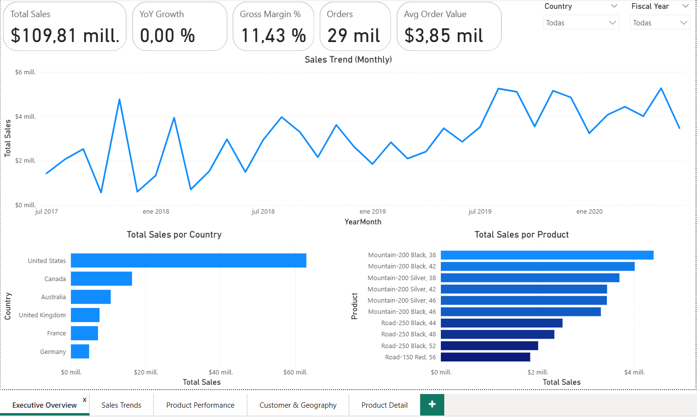
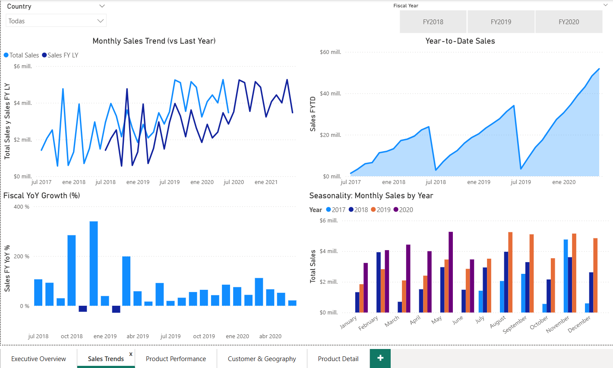
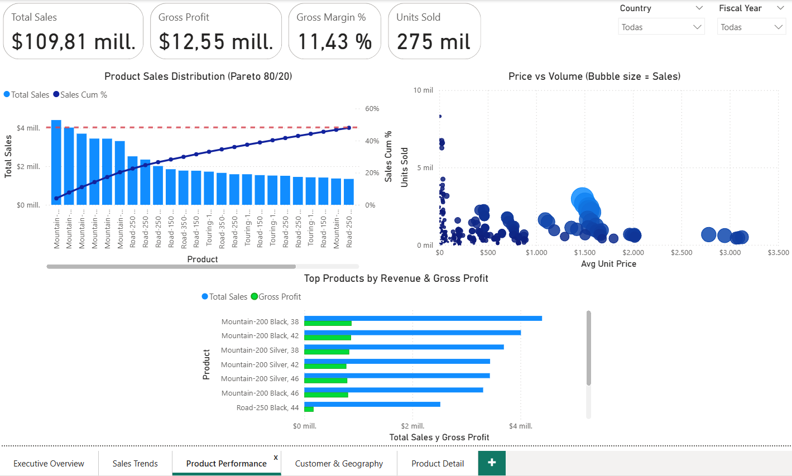
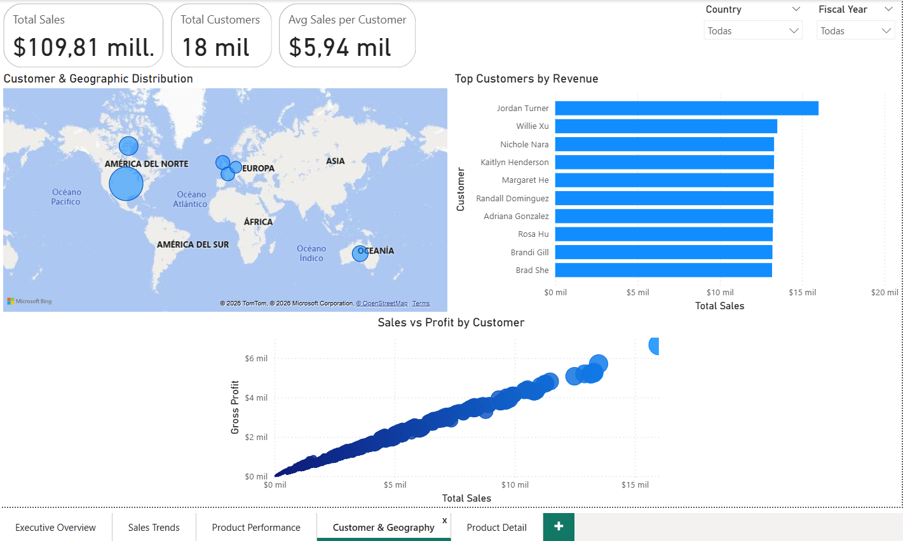
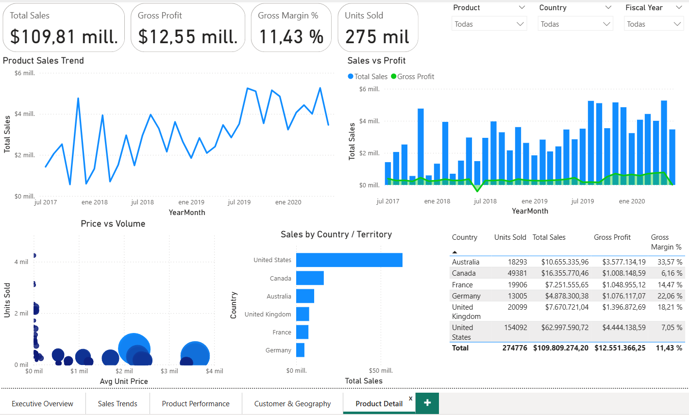

# AdventureWorks Sales Analytics Report (Power BI)
Project Overview

This project analyzes sales performance using the Microsoft AdventureWorks dataset.
The goal is to transform raw transactional data into business insights through data modeling, DAX calculations, and interactive Power BI dashboards.

The report provides an executive-level overview of revenue, profitability, product performance, customer behavior, and geographic distribution.

Tools Used

Power BI

Power Query

DAX

Data Modeling

Microsoft AdventureWorks Dataset

Key Business Metrics

The report tracks several important business indicators:

Total Sales: $109.81M

Gross Profit: $12.55M

Gross Margin: 11.43%

Units Sold: 275K

Total Customers: 18K

Average Order Value: $3.85K

These KPIs provide a quick overview of overall business performance.

Dashboard Sections
Executive Overview

Provides a high-level summary of the company's performance including:

Total revenue

Gross profit and margin

Units sold

Monthly sales trends

Sales distribution by country

Top-selling products

This page allows decision-makers to quickly assess overall business performance.

Sales Trends

Focuses on time-based sales analysis:

Monthly sales trends

Year-over-year comparison

Year-to-date sales

Seasonal patterns

This analysis helps identify growth trends and seasonality in sales performance.

Product Performance

Analyzes product-level performance using:

Pareto analysis (80/20 rule)

Price vs volume relationship

Top products by revenue

Gross profit contribution

This page helps identify high-performing products and pricing strategies.

Customer & Geography

Explores customer and geographic insights:

Sales distribution across countries

Top customers by revenue

Relationship between sales and profitability

These insights help understand market distribution and customer concentration.

Product Detail

Provides detailed product-level analysis including:

Sales trends per product

Profitability comparisons

Price vs demand analysis

Geographic sales distribution

Data Modeling

The dataset was transformed using Power Query and structured using a relational data model connecting:

Sales

Products

Customers

Geography

Time

DAX measures were created to calculate KPIs such as:

Total Sales

Gross Profit

Gross Margin %

Average Order Value

Year-over-Year Growth

Business Insights

The analysis highlights several important insights:

A small group of products generates the majority of revenue (Pareto effect).

Sales show strong seasonal patterns across years.

Certain geographic markets contribute disproportionately to total revenue.

Higher priced products do not always correspond to higher sales volume.

These findings can help guide pricing strategies, inventory planning, and market prioritization.

Project Files

Power BI Report:
AdventureWorks Sales Analytics Report – Power BI Project.pbix

Author

Gabriel El Khaouli
Aspiring Data Analyst | Power BI | SQL | Excel
